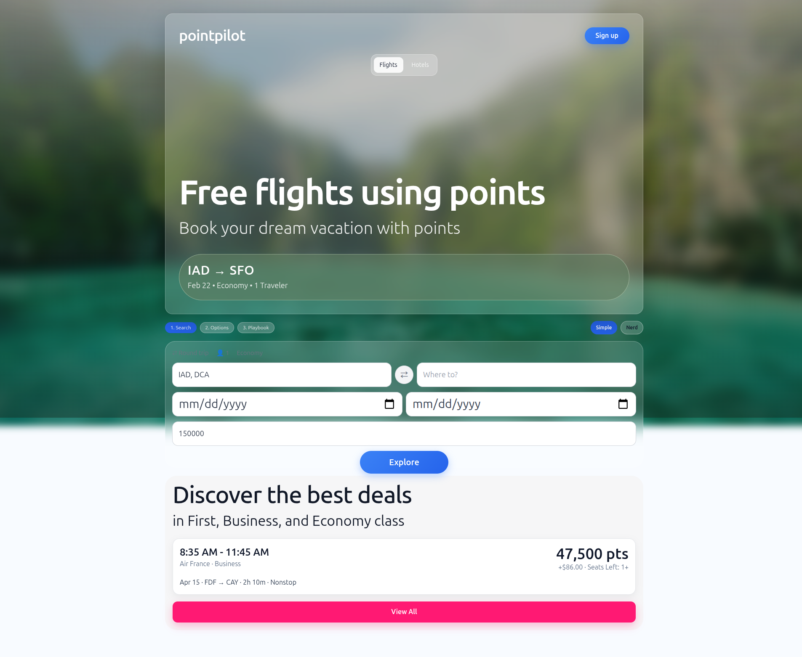

# PointPilot

Fly smarter with points you already have.

PointPilot is a points-first trip planning app that helps users:
- search trips,
- compare ranked options,
- generate a booking playbook.

No auto-booking is performed.

---

## Current Status (latest)

### Frontend (default)
- **Next.js + TypeScript** app in `frontend/`
- **Desktop/web-first** by default (mobile still supported)
- Roame/Google-Flights-inspired search layout
- 3-step flow:
  1. Search
  2. Options
  3. Playbook
- Simple / Nerd mode toggle

### Search UI (latest)
- Top controls row: trip type, traveler count, cabin
- Route row: From + swap + Where to
- Date row: Departure + Return
- Dedicated points row: “How many points do you want to use?”
- Centered Explore CTA

### Backend
- FastAPI service in `backend/`
- Endpoints for trip search, recommendations, and playbook
- Local JSON persistence for MVP (`data/*.json`)

### Legacy UI
- Streamlit app (`app.py`) remains in repo for fallback/testing
- Not the default experience

---

## Screenshots

### Desktop Home (current)



---

## Architecture

### Frontend
- `frontend/app/page.tsx` — main product flow/UI
- `frontend/app/globals.css` — styling + layout system
- `frontend/lib/api.ts` — API client calls
- `frontend/lib/types.ts` — TypeScript models

### Backend
- `backend/app/main.py`
- Routers:
  - `trip_searches.py`
  - `recommendations.py`
  - `playbook.py`
  - `alerts.py`
- Services:
  - `recommender.py`
  - `scoring.py`
- Adapters:
  - `adapters/providers.py`

---

## MVP Constraints

### Origins
- US departure airports only (enforced)

### Destination scope
- North America
- Argentina
- Peru
- France
- Italy
- UK
- Iceland
- Greece
- Japan
- Thailand

Current destination pool includes:
`CUN, PUJ, NAS, SJD, YVR, EZE, LIM, CDG, FCO, LHR, KEF, ATH, HND, BKK`

---

## Setup

### 1) Install dependencies

Backend:
```bash
cd backend
pip install -r requirements.txt
```

Frontend:
```bash
cd ../frontend
npm install
```

### 2) Environment variables

Backend (`backend/.env`):
```bash
AMADEUS_CLIENT_ID=your_id
AMADEUS_CLIENT_SECRET=your_secret
SEATS_AERO_API_KEY=your_key_optional
SEATS_AERO_URL=https://your-award-endpoint.example.com/search
```

Frontend (`frontend/.env.local`):
```bash
NEXT_PUBLIC_API_BASE=http://localhost:8000
```

### 3) Run locally

Backend:
```bash
cd backend
uvicorn app.main:app --reload --port 8000
```

Frontend:
```bash
cd frontend
npm run dev
```

Open:
- Frontend: `http://localhost:3000`
- API docs: `http://localhost:8000/docs`

---

## Deploy (Vercel + backend host)

- Deploy `frontend/` to Vercel
- Set `NEXT_PUBLIC_API_BASE` in Vercel project settings
- Host backend separately (Render/Railway/Fly/etc.)

---

## API Endpoints (MVP)

- `GET /health`
- `POST /v1/trip-searches`
- `GET /v1/trip-searches/{id}`
- `POST /v1/recommendations/generate`
- `POST /v1/playbook/generate`
- `POST /v1/alerts`
- `GET /v1/alerts`
- `PATCH /v1/alerts/{id}`

---

## Notes

- Recommendations use short TTL caching for repeated identical queries.
- Live/fallback transparency is exposed in response fields (`api_mode`, source labels/timestamps).
- JSON persistence is MVP-grade only (not production-scale).